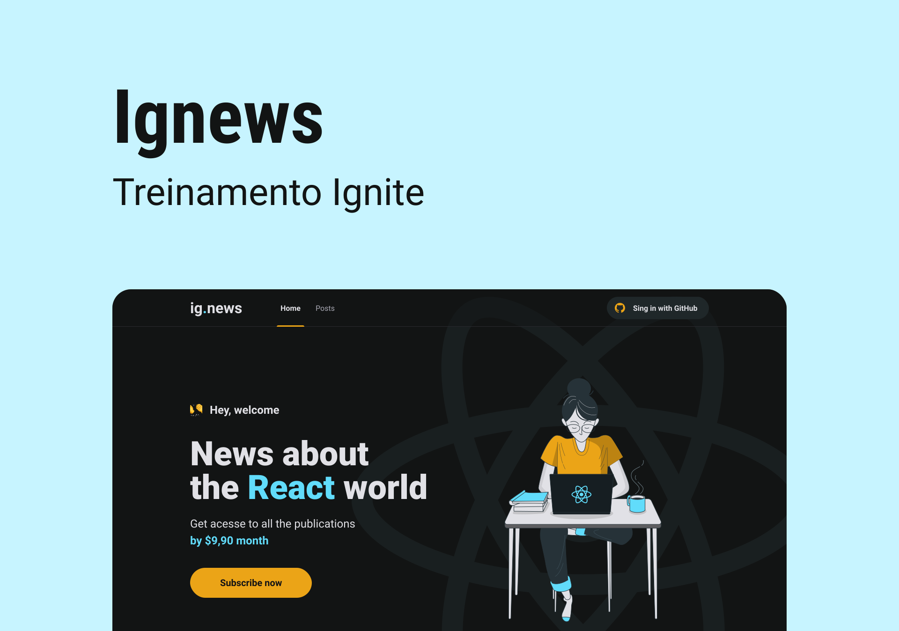

# IGNEWS

Desafio realizado com o intuito de entender os conceitos do framework Next.js, como o SSR e SSG. Esse projeto também utiliza de outras ferramentas, como o Stripe, uma API para pagamentos, o Github OAuth, para autenticar usuários, o FaunaDB para salvar dados utilizando de funções serveless e o Prismatic CMS, para gerenciamento de conteúdo.  

 

